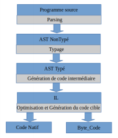
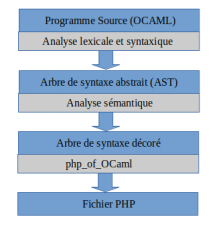
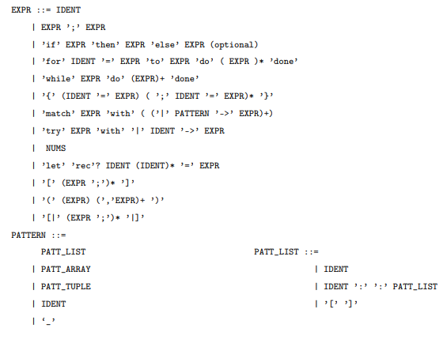
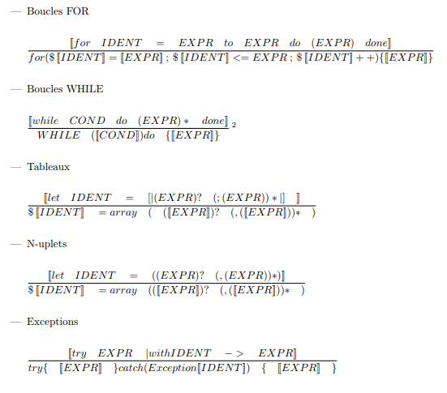
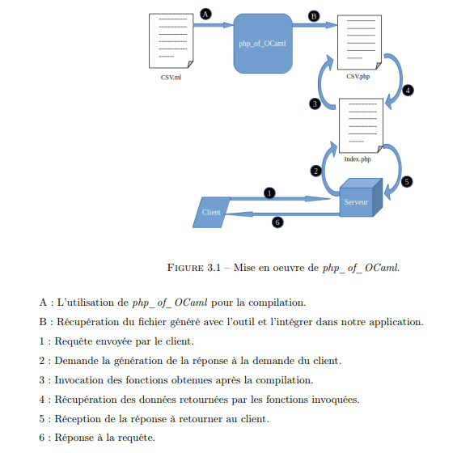

# php_of_ocaml

> Pour plus de détails consulter le [Rapport](Rapport/Rapport_PSTL_php_of_OCaml.pdf)

> Notre projet consiste à développer un compilateur php_of_OCaml en partant du compilateur OCaml,
permettant aux développeurs de ce langage fonctionnel de traduire du code écrit en OCaml vers un code
lisible en langage PHP, interprété et typé dynamiquement, qui sera destiné à être exécuté sur les serveurs
web.

> la génération du code PHP à partir de l’AST typé d’un programme OCaml.

## Compilation en OCaml
  Les phases de génération de code du compilateur Objective OCAML.
  


## Compilation avec php_of_OCaml
  les étapes de compilation de notre outil php_of_OCaml en utilisant le compilateur
OCaml, dont la sortie sera un fichier PHP sémantiquement équivalent au programme source OCaml.



## Grammaire du langage source


##  Squelettes de traduction


## Exemple d'utilisation


## Le code en entré
```ocaml
open Printf
type user = {
   mutable id: int;
   mutable nom: string;
   mutable date_naissance: string;
   mutable mail: string;
   mutable telephone: string;
 }
 let split chaine separateur =
  let result = ref [] in
  begin
    let ch = ref "" in
      for i = 0 to String.length chaine - 1 do
      begin
        if chaine.[i] = separateur then
        begin
          result := !ch :: !result; ch := ""
        end
        else
          ch := !ch^(String.make 1 chaine.[i])
        end
      done;
        result := !ch :: !result;
    end;
 !result

 let lire_file file =
  let entree = (open_in file)
  and result = ref [] in
  begin
  try
    let ligne = ref (split (input_line entree) ’;’ ) in
      let nb_champs = (List.length !ligne) in
      while true do
        if (List.length !ligne) != nb_champs then
          print_endline "Erreur de lecture"
        else
          result := List.append !result [ !ligne ];
          ligne := (split (input_line entree) ’;’ )
        done
      with
      | End_of_file -> close_in entree
      (∗ fclose ( $file ) ; ∗)
  end;

 !result

let write usr =
 let id = (string_of_int (usr.id)) in
  let file = "Inscription.csv" in
   let x = id^";"^usr.nom^";"^usr.date_naissance^";"^usr.mail^";"^usr.telephone^"\n" in
    let flag_list = [Open_append] in
     let sortie = open_out_gen flag_list 755 file in
      output_string sortie x;
      close_out sortie
      
let clean file =
 let out_chanel = open_out file in
  output_string out_chanel "";
  close_out out_chanel
  
let delete id =
 let file = "Inscription.csv" in
  let id = string_of_int id in
   let list_ligne = lire_file file in
    let l = ref list_ligne in  
      clean file;
      
 for i = 0 to List.length !l -1 do
 begin
  let subList = (List.nth !l i) in
    if((List.nth subList 4) <> id) then
    begin
      let usr_search = ref {
        id = int_of_string (List.nth subList 4) ;
        nom = (List.nth subList 3);
        date_naissance = (List.nth subList 2);
        mail = (List.nth subList 1);
        telephone = (List.nth subList 0);
      } in
      write (!usr_search)
    end
    else ()
  end
  done  
 
let search id_usr =
 let usr_search = ref {
  id = -1 ;
  nom = "";
  date_naissance = "";
  mail = "";
  telephone = "";
 } in 
 let id = (string_of_int (id_usr)) in
 let file = "Inscription.csv" in
 let list_ligne = lire_file file in
 let l = ref list_ligne in
  for i = 0 to List.length !l -1 do
  begin
   let subList=(List.nth !l i) in
   if((List.nth subList 4) = id) then
   begin
     !usr_search.id <- id_usr;
     !usr_search.nom <- (List.nth subList 3);
     !usr_search.date_naissance <- (List.nth subList 2);
     !usr_search.mail <- (List.nth subList 1);
     !usr_search.telephone <- (List.nth subList 0)
   end
   end
 
 done;
 !usr_search

 get_list () =
  let list_users = ref [] in
  let file = "Inscription.csv" in
  let list_ligne = lire_file file in
  let l = ref list_ligne in
   for i = 0 to List.length !l -1 do
   begin
     let usr_search = ref {
       id = int_of_string (List.nth (List.nth !l i) 4) ;
       nom = (List.nth (List.nth !l i) 3);
       date_naissance = (List.nth (List.nth !l i) 2);
       mail = (List.nth (List.nth !l i) 1);
       telephone = (List.nth (List.nth !l i) 0);
     } in
       list_users := usr_search :: !list_users ;
   end
  done;
!list_users
```
## Le code génére

```php
<?php
  function split ( $chaine, $separateur ){
     $result =(array());
     $ch =("");
     for ($i=0; $i <= (strlen($chaine)-1); $i++)
     {
       if ( ( ($chaine[$i]) == $separateur) ) {
       array_unshift ( ($result) , ($ch) ) ;
       ( $ch = "" );
     }else{
      ( $ch = (($ch). ( ($chaine[$i]) )) );
     }
     }
      array_unshift ( ($result) , ($ch) ) ;

     return ($result) ;
   }

function lire_file ( $file ){
$entree =fopen($file , "r" );
$result =(array());

 try{
    $ligne =(split(fgets($entree),’;’));
    $nb_champs =sizeof(($ligne));
 
 while (true )
 {
    if ( (sizeof(($ligne))!=$nb_champs) ) {
       break;
    }else{
       array_merge(($result), ( ($ligne) ) );
    }
    ( $ligne = split(fgets($entree),’;’) );
 }
 }catch (Exception $e){
    fclose($entree);
 } 
return ($result) ; 
}

function write ( $usr ){
  $id =strval($usr[’id’]);
  $file = "Inscription.csv";
  $x = ($id.(";".($usr[’nom’].(";".($usr[’date_naissance’].(";".($usr[’mail’].(";".($usr[’
        telephone’]."\n") ) ) ) ) ) ) ) ) ;
  file_put_contents($file, $x, FILE_APPEND | LOCK_EX);
  fclose($sortie);
}

function clean ( $file ){
  $out_chanel =fopen($file , "w" );
  fputs($out_chanel,"");
  fclose($out_chanel);
}

function delete ( $id ){
  $file = "Inscription.csv";
  $id =strval($id);
  $list_ligne = lire_file ($file);
  $l =($list_ligne);
  clean ($file);
  
  for ($i=0; $i <= (sizeof(($l))-1); $i++)
  {
    $subList = ($l)[$i];
     if ( ($subList[4]<>$id) ) {
        $usr_search = [
             ’id’ => intval($subList[4]),
             ’nom’ => $subList[3],
             ’date_naissance’ => $subList[2],
             ’mail’ => $subList[1],
             ’telephone’ => $subList[0]
        ] ;
      write (($usr_search));
      } else{ }
    }
 }
 
function search ( $id_usr ){
  $usr_search = [
          ’id’ => -1,
          ’nom’ => "",
          ’date_naissance’ => "",
          ’mail’ => "",
          ’telephone’ => ""
    ] ;
  $id =strval($id_usr);
  $file = "Inscription.csv";
  $list_ligne = lire_file ($file);
  $l =($list_ligne);
  
  for ($i=0; $i <= (sizeof(($l))-1); $i++)
  {
    $subList = ($l)[$i];
    if ( ($subList[4] == $id) ) {
        ($usr_search)[’id’]=$id_usr;
        ($usr_search)[’date_naissance’]=$subList[2];
        ($usr_search)[’telephone’]=$subList[0];
    }
   }
 return ($usr_search) ;
}

function get_list ( ){
  $list_users =(array());
  $file = "Inscription.csv";
  $list_ligne = lire_file ($file);
  $l =($list_ligne);
 
  for ($i=0; $i <= (sizeof(($l))-1); $i++)
  {
      $usr_search = [
                ’id’ => intval(($l)[$i][4]),
                ’nom’ => ($l)[$i][3],
                ’date_naissance’ => ($l)[$i][2],
                ’mail’ => ($l)[$i][1],
                ’telephone’ => ($l)[$i][0]
        ] ;
    array_unshift ( ($list_users) , $usr_search ) ;
   }

  return ($list_users) ;
}

?>

```

